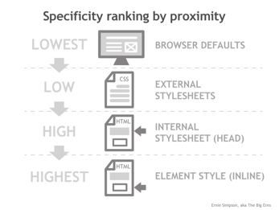

### Question :

The C in CSS stands for "Cascade". What does this terminology mean and what is its significance to how CSS is interpreted?
<hr>


The C in CSS stands for "Cascade" but what does this mean for the code your write. Well it means a lot actually, by knowing how to use cascade effectively you can save a lot of time and also overwrite styles where you want something different.

Lets start with how this works with the stylesheets that you might add to your project. For example,  you create a external and internal sheet and you use some inline styling. Each of these sheets has its own ranking in the cascade.

The image below represents this cascade effect. The browser default has the lowest rank and so on till you get to inline styling with the highest rank. 

<div style="display:flex;justify-content:center;align-items:center;"></div>

 
This cascading effect can be compared to a waterfall but I feel that analogy doesn't quite represent what cascade is doing well. I would compare it to a train. The engine of the train is the highest priority stylesheet available in the project with the lower priority styles representing the individual carts of the train, ending with the lowest priority which will always be the browser defaults of course unless you use only the browser defaults.


Since they are all connected to the front of the train they all share the same styles starting from the back to the front. However anywhere in this chain, if the previous cart's style changes, then it is because the cart in front has higher priority. Any changes that the higher priority stylesheet didn't change will remain so as long as no other stylesheet changes it down the line.  


## Example 

<p data-height="277" data-theme-id="dark" data-slug-hash="bwNGoX" data-default-tab="html,result" data-user="nopity" data-embed-version="2" data-preview="true" class="codepen">See the Pen <a href="http://codepen.io/nopity/pen/bwNGoX/">The Cascade Effect</a> by oscar (<a href="http://codepen.io/nopity">@nopity</a>) on <a href="http://codepen.io">CodePen</a>.</p>
<script async src="//assets.codepen.io/assets/embed/ei.js"></script>


Illustrating the cascade effect above, an external stylesheet makes changes but the internal style overrides some of these effects. Comment out the internal stylesheet to see what happens. This can be done quickly by holding command(ctrl on windows) and forward slash while the text is highlighted.


Now the external has higher priority , its become the conductor so to speak, and calls the shots to what can display in the browser. Any element changed by the conductor overrides all the previous stylesheets. 


## Inside the Sheets

The inner workings of  stylesheets are not immune to the cascade effect. The styles up top can change because of the styles that came after. 

There are rules that apply when writing css, below they will be written:


* When the same element is written twice the last one has priority:

```css
p { color:red}
p { color:green}
/* Green color will be applied */
```
* The style with the highest specificity will be applied :
  * ID attribute = 100
  
  * Class attribute = 10
  
  * Element = 1
		
```css
<body>
 <p id="target" class="first">This is a text</p>
</body>
<style>
 #target {color:blue} // Specificity:100
 p#target {color:red} // Specificity:101
 p.first {font-size:2em} // Specificity:11
 p { color: purple} // Specificity: 1
</style>
```		
* Using `!important` will give the element the  highest priority
 
 
```css
p { color:red !important}
p { color:green}
/* red will be applied because !important has highest priority of all attributes */
```
Only use `!important` as a last resort and better to not use at all. When it comes to your code you want stay away from writing to many selectors to target an element. 

```css
/* don't do this */
h1 p ul li a {
  color: blue;
  text-decoration: none;
}
/* Do this */
.linkLanding {
color:blue;
text-decoration: none;
}
``` 
Better to use classes instead so that your code is more readable and won't have to waste time to override previous code. Use `id` to target unique containers or to add a scroll functionality to page. Use this motto: `class`es are for a groups and `id`s are for individuals is an easy way to remember the difference between each. 
 
## Wrap Up 
 We have gone over what the "C" in CSS means, from the way it effects how stylesheets are used to how CSS you write uses these principles with attributes so now go experiment and have fun.   

<br>