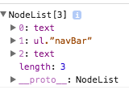

## **Exercises 1**

**1.** We can find analogies to the concept of the DOM and a DOM tree in our daily lives. For instance, a DOM tree is like a hierarchy of employees in a company with the CEO (a node) at the top of the tree while the employees (more nodes) fill out the tree, progressively connected to their superior (nodes) at the top. Provide another such analogy clearly describing the hierarchy and the nodes in it.

<span class="label label-warning">Answer:</span><br>
We could compare the DOM to a pyramid with the top being the top node with the lower blocks being more nodes connected to the top block.

**2.** From the discussion about DOM, we see that it helps developers by providing an access mechanism to manipulate web pages and helps browsers render web pages faster. Can you list two possible disadvantages of using the DOM and why? You can refer to any resources online to come up with a suitable response.

   	<span class="label label-warning">Answer:</span> <br>

   		Memory Intensive - uses a lot memory which can slow the load times of pages<br>
   	   Proprietary traps (browser and server traps)<br> <br>

**3.** XML is another markup language that is very similar to HTML. Research the difference between XML DOM and HTML DOM (if there is any). Justify your reasoning with examples.

   <span class="label label-warning">Answer:</span><br>
	The main difference is that html DOM knows about html where xml does not have any   predefined elements.

HTML has a <table> tag for example where XML does not have no such tag making it so that if nodes are removed from the html document it can maintain its structure.

<br>

## **Exercises 2**
<a href="http://codepen.io/nopity/pen/vXZBaB?editors=1010" class="btn btn-link" target="_blank" style="font-size:16px">Codepen for question 1 and 2</a><br>

**1.** Use the links array to get hold of the hyperlink in the second anchor on the document (name=”contact”). Using the href property, assign a new link to the anchor. The new hyperlink is : href=”http://www.learn.moderndeveloper.com”

<span class="label label-warning">Answer:</span><br>

```javascript
document.links['contact'].href = 'http://www.learn.moderndeveloper.com';
```

**2.** Get the footer image using the images array. Assign the height of the image as 300px and width of the image as 800px.

<span class="label label-warning">Answer:</span><br>

```javascript
   document.images['footerImage'].style.width = "800px";
   document.images['footerImage'].style.height = "300px";
```


**3.** Research three additional properties for each the location and the navigator objects. Explain their purpose/use in a single sentence and specify their syntax.

<span class="label label-warning">Answer:</span><br>


### Location Properties
<ul>
<li>The password specified before the domain name <br>
Property: <a href="https://developer.mozilla.org/en-US/docs/Web/API/HTMLHyperlinkElementUtils/password" target="_blank">location.password</a>
</li><br>
<li>
Returns the pathname starting at the first '/' <br>
Property: <a href="https://developer.mozilla.org/en-US/docs/Web/API/HTMLHyperlinkElementUtils/pathname" target="_blank">location.pathname</a>
</li><br>
<li>
Returns the pathname starting at the first '#' <br>
Property: <a href="https://developer.mozilla.org/en-US/docs/Web/API/HTMLHyperlinkElementUtils/hash" target="_blank">location.hash</a>
</li>
</ul>

## Navigator Properties
<ul>
<li>
Returns a geolocation object allowing access to the location of the device <br>
Property: <a href="https://developer.mozilla.org/en-US/docs/Web/API/Navigator/geolocation" target="_blank">navigator.geolocation</a>
</li><br>
<li>
Provides a NetworkInformation object that has information about the network connection of device <br>
Property: <a href="https://developer.mozilla.org/en-US/docs/Web/API/Navigator/connection" target="_blank">navigator.connection</a>
</li><br>
<li>
Returns a boolean indicating if java is enables on browser<br>
Property: <a href="https://developer.mozilla.org/en-US/docs/Web/API/NavigatorPlugins/javaEnabled" target="_blank">navigatorPlugins.javaEnabled</a>
</li>
</ul>

<br>

## **Exercises 3**


**1.** Which Node type constants will you use to check the type of nodeForm and the nodeInput objects? Write the syntax to perform the check.

<span class="label label-warning">Answer:</span><br>

```javascript
nodeForm.nodeType == 1

nodeInput.nodeType == 1
```
**2.** Write the command for getting the name of the nodeForm object. Use the appropriate property

<span class="label label-warning">Answer:</span><br>

```javascript
name = nodeForm.nodeName;
```


**3.** Write the command for getting the value of the nodeInput object. Use the appropriate property

<span class="label label-warning">Answer:</span><br>

```javascript
value = nodeInput.nodeValue;
```
<br>

## **Exercises 4**

<a href="https://jsbin.com/nikime/edit?html,js,output" class="btn btn-link" target="_blank" style="font-size:16px">Jsbin for this section</a><br>
**1.** Use the appropriate property to return the child node of the nodeNav object. How many HTML elements will be returned and which ones?.

<span class="label label-warning">Answer:</span><br>

We would get a #text node, ul tag, and another text node . The text node are set to null because they are just whitespace. As you can see from
image below the text nodes are set to null at index 1 is are ul element.

```javascript
var children = nodeNav.childNodes
```



<br>

**2.** Use one of the node properties discussed above to return the first child under the ul. Provide the proper syntax.

<span class="label label-warning">Answer:</span><br>

```javascript
 var firstChildUl = nodeNav.firstChild.nextSibling.firstChild.nextSibling;
```
<br>

**3.** Using the sibling properties, return the node with the text Accounts within it. Provide the proper syntax.

<span class="label label-warning">Answer:</span><br>

```javascript
var lastChildUl = nodeNav.firstChild.nextSibling.lastChild.previousSibling;
```
<br>

## **Exercises 5**

<a href="https://jsbin.com/neqiwis/edit?html,js,output" class="btn btn-link" target="_blank" style="font-size:16px">Jsbin for this section</a><br>
**1.** Use the appropriate property on the nodeNavList object to return the first child under it. After obtaining the child node, use the appendChild property to append the text node “Online Banking” to it.

<span class="label label-warning">Answer:</span><br>

```javascript
var li_node = nodeNavBarList.firstChild;
  var text_node = document.createTextNode("Online Banking");

  li_node.appendChild(text_node);

  document.getElementsByClassName("navBar").appendChild(li_node);
```
**2.** Use the appropriate sibling properties to traverse to the second list element (Mobile Banking) and delete this node using the removeChild property.

<span class="label label-warning">Answer:</span><br>

```javascript
  var mobile = document.getElementById("mb");

  nodeNavBarList.removeChild(mobile);
```

**3.** Use the nodeNavBarDiv object to get the value of its id attribute.

<span class="label label-warning">Answer:</span><br>

```javascript
  var parent = nodeNavBarDiv;
  var attr = parent.getAttribute('id');
  document.getElementById("domValues").innerHTML = "this is the id for topNavBarDiv: " + attr;
```

**4.** Use the node properties on the nodeNavList object. Return the last list item under the ul element. Use the setAttribute property to set id=”al” on the obtained node.

<span class="label label-warning">Answer:</span><br>

```javascript
var parent = nodeNavBarList.lastChild;
parent.setAttribute("id", "al");
document.getElementById("domValues").innerHTML = "this is the new id for the last li element: " + parent.id;
```
<br>

## **Exercises 6**

<a href="https://jsbin.com/tijici/edit?html,js,output" class="btn btn-link" target="_blank" style="font-size:16px">Jsbin for this section</a><br>

**1.** Use the setAttribute method to change the value of the identity attribute (id) from navBar to bankingTopNavigation.

<span class="label label-warning">Answer:</span><br>

```javascript
  var parent = document.getElementById("navBar");
  parent.setAttribute('id','bankingTopNavigation');
```

**2.** Create a new element of type li. Create a new text node with the contents “ACH/Wire Transfer.” Append the text node to the newly created list node. Finally, append this updated list node to the unordered list using the appendChild method.

<span class="label label-warning">Answer:</span><br>

```javascript
    var li_node = document.createElement('li');
    var text_node = document.createTextNode('ACH/Wire Transfer.');
    li_node.appendChild(text_node);
    var Ul =  document.getElementById('navBar').firstChild.nextSibling;
    Ul.appendChild(li_node);
```
**3.** Use the firstChild and the lastChild properties to get hold of the first and last li elements under the parent ul node. Display the contents between the anchor tags for both the children (Hint: nodeValue property).

<span class="label label-warning">Answer:</span><br>

```javascript
var Ul =  document.getElementById('navBar').firstChild.nextSibling;
var first = Ul.firstChild.nextSibling;
var last = Ul.lastChild.previousSibling;

var li_1 =  first.innerHTML;
var li_2 = last.innerHTML;
```
<br>

## **Exercises 7**

<a href="https://jsbin.com/yumowu/edit?html,js,output" class="btn btn-link" target="_blank" style="font-size:16px">Jsbin for this section</a><br>

**1.** Which method will you use to return the element with id="navBar"? Specify the appropriate syntax.

<span class="label label-warning">Answer:</span><br>

*There is a typo in the code it's suppose to be id="navBar".*

```javascript
var Ul = document.querySelector(".navBar");
```
**2.** Which method will you use to return all the elements with class=”Info”? Provide the command to return the desired values.

<span class="label label-warning">Answer:</span><br>

```javascript
var allInfoClasses = document.querySelectorAll(".Info");
```
**3.** Use the querySelectorAll method to return all the li items under the ul node. Write the appropriate loop to modify the text to have a red font color and underlining.

<span class="label label-warning">Answer:</span><br>

```javascript
 var allListItems = document.querySelectorAll("#navBar li");

  for(var i = 0; i < allListItems.length; i++) {
     allListItems[i].style.color = "red";
     allListItems[i].style.textDecoration = "underline";
```

**4.** What is wrong with the following line of code with respect to the HTML markup provided for this exercise?
var elementSelected = document.querySelector(“.topNavigation”);
Justify your response with proper reasoning.

<span class="label label-warning">Answer:</span><br>

This code returns `null` because the class `topNavigation` does not exist within the document. Checkout the Jsbin to verify this.

```javascript
  var nothing = document.querySelector(".topNavigation");
```

<br>

## **Exercises 8**

<a href="https://jsbin.com/ximagig/edit?html,js,output" class="btn btn-link" target="_blank" style="font-size:16px">Jsbin for this section</a><br>


**1.** Write a JavaScript statement to return the first item in the list (Online Banking) using the `querySelector()` method.

<span class="label label-warning">Answer:</span><br>

```javascript
var firstLi = document.querySelector('#ob');
```
**2.** Use the `querySelectorAll()`` method to retrieve the count of the number of items in the list. (Hint: Use CSS selectors and the length property)

<span class="label label-warning">Answer:</span><br>

```javascript
var allLi = document.querySelectorAll('.navBar li');
var lengthLi = allLi.length;
```
**3.** Write a statement to retrieve the HTML markup within the fourth list item, i.e. the item with `id=”cc”`.

<span class="label label-warning">Answer:</span><br>

```javascript
var fourthLi = document.querySelector('#cc');
output_before = fourthLi.innerHTML;
```

<br>
<br>