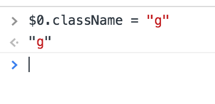
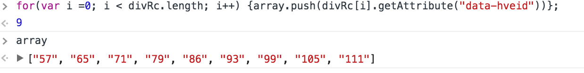
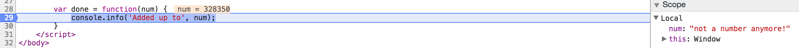
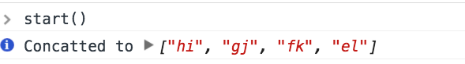
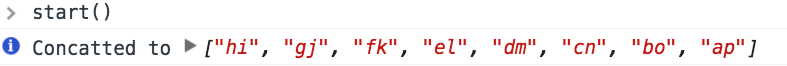

## **Exercises 1**

**1. Using the Elements panel, remove the entire first result from the DOM (div with class="g" and down).**

<span class="label label-warning">Answer:</span><br>

First search result still there. 


<br>
First search result has been removed. I right clicked on it and clicked on "remove element".


<br>
**2. On the second result (now the first), remove all classes from the top-level div.**

<span class="label label-warning">Answer:</span> <br>

This is an image with the class removed notice the text styling difference. I did this by right clicking on element and selecting edit attributes then deleting the class. 

       
<br>
**3. Using the Console panel, add the class g back to the div you just removed it from.**

   <span class="label label-warning">Answer:</span><br>

   I added it back by selecting it in the elments panel then using  `addclass` to add class of g back to the element.
  
<br>
**4. Using the Console panel, iterate through all the results that remain and create an array containing all the hve-id values (found on div element directly beneath each result container element).**

<span class="label label-warning">Answer:</span><br>

For this answer I made a for loop to go over an array and push all those elements to an empty array. `divRc` is equal to `document.querySelectorAll('rc');` The querySelectorAll returns an array of all the elements with that class from there I used the getAttribute to get the contents of `data-hveid` in push them to the empty array. 


  

**5. On the Resources panel, review all the different types of locally stored data. Then, in “Session Storage,” find an entry related to #resultStats (acta::-20 at time of writing) and update the style to move the element 100px to the right (note you’ll have to reload the page to see the result).**

<span class="label label-warning">Answer:</span><br>

I attempted this exercise but could not get the results that where asked for. Another student pointed out that google is now doing checksums so its overwriting the changes I made I am not sure if there is a way to disable this feature but would like suggestions here upon review. 

<br>

## **Exercises 2**


**1. Using the code-execution.html from our example above, set a breakpoint that stops execution just before logging the result to the console. Once paused, change the value that will be logged from the total to a string "Not a number anymore!"; then, resume execution.**

<span class="label label-warning">Answer:</span><br>

This is an image of me changing the console.log to "Not a number anymore!".

  

**2. Using the code-execution-bug.html, track the code execution via DevTools and identify why the out array only has four elements instead of eight; then, correct the code to fix it.**

<span class="label label-warning">Answer:</span><br>

<a href="https://jsbin.com/cagatoxiji/edit?html,js,console" class="btn btn-link" target="_blank" style="font-size:16px">Jsbin for this answer</a><br>

This is the code for the execution bug :

```javascript
  var start = function () {
    var data = ['a', 'b', 'c', 'd', 'e', 'f', 'g', 'h']
      , remaining = ['i', 'j', 'k', 'l', 'm', 'n', 'o', 'p']
      , out = [];
    for (var i = 0; i < data.length; i++) {
      var el = data.pop()
        , r = remaining[i];
        out.push(el + r);
    }
    done(out);
  }
  var done = function (result) {
    console.info('Concatted to', result);
  }
```
And in it's corrent start we get an output of only for items to the array instead of the expected eight as shown. 

 

The problem with the code is that when we pop off the the last item from the data array we are in effect substacting from the length of the array and because we use `data.length` this means we will never reach all eight items. 

Now there are two ways we can solve this the first one not being ideal but a quick fix which is we replace `data.length` with the number 8. Now the reason this isn't ideal is because in the future our array may grow larger and we don't want to have to manually change this value all the time.

The final and best way is to use `remaining.length` instead because this array will always be what it is since we are not using the pop method. Now that we made this change we get this.

 
<br>

## **Exercises 3**


**1. Using the Network panel, identify which JavaScript file took the longest to load.**

<span class="label label-warning">Answer:</span><br>

The detector.js file takes the longest to load coming in at 10ms. 

**2. Using the Network panel, identify which query parameter Google uses to send the “original query” when executing a new search for “modern web development testing.”**

<span class="label label-warning">Answer:</span><br>

Not sure what this question is asking or what I'm looking for left a message on QA.


**3. Use the timeline panel to profile how long it takes Google to load the search results page. From the summary, what category takes the longest? How long does Rendering take? What is the range of the JS Heap?**

<span class="label label-warning">Answer:</span><br>

It takes browser about 1.82 seconds to load the search page using chrome browser. The longest category is the scripting coming in at 950.8ms and the rendering taking 94ms. The range of the JS Heap is 36MB to 65.5MB.

<br>

## **Exercises 4**


**1. If you haven’t done so already, set up your phone for remote debugging. If you use an iOS device, use the Safari tools if you have a Mac, or WeInRe if you’re on Windows.**

<span class="label label-warning">Answer:</span><br>

N/A since can't show this 


<br>

**2. Once setup, open Google on your phone and begin inspecting it via the Remote Debugger.**

<span class="label label-warning">Answer:</span><br>

N/A since can't show this 
<br>

**3. Test using the splitview to navigate via your computer’s mouse and keyboard.**

<span class="label label-warning">Answer:</span><br>

N/A since can't show this 
<br>


**4. Execute a search, then, repeat the same exercises from the first section of this chapter on your mobile device.**

<span class="label label-warning">Answer:</span><br>

N/A since can't show this 

## **Exercises 5**

<a href="https://jsbin.com/neqiwis/edit?html,js,output" class="btn btn-link" target="_blank" style="font-size:16px">Jsbin for this section</a><br>
**1.** Use the appropriate property on the nodeNavList object to return the first child under it. After obtaining the child node, use the appendChild property to append the text node “Online Banking” to it.

<span class="label label-warning">Answer:</span><br>

```javascript
var li_node = nodeNavBarList.firstChild;
  var text_node = document.createTextNode("Online Banking");

  li_node.appendChild(text_node);

  document.getElementsByClassName("navBar").appendChild(li_node);
```
**2.** Use the appropriate sibling properties to traverse to the second list element (Mobile Banking) and delete this node using the removeChild property.

<span class="label label-warning">Answer:</span><br>

```javascript
  var mobile = document.getElementById("mb");

  nodeNavBarList.removeChild(mobile);
```

**3.** Use the nodeNavBarDiv object to get the value of its id attribute.

<span class="label label-warning">Answer:</span><br>

```javascript
  var parent = nodeNavBarDiv;
  var attr = parent.getAttribute('id');
  document.getElementById("domValues").innerHTML = "this is the id for topNavBarDiv: " + attr;
```

**4.** Use the node properties on the nodeNavList object. Return the last list item under the ul element. Use the setAttribute property to set id=”al” on the obtained node.

<span class="label label-warning">Answer:</span><br>

```javascript
var parent = nodeNavBarList.lastChild;
parent.setAttribute("id", "al");
document.getElementById("domValues").innerHTML = "this is the new id for the last li element: " + parent.id;
```
<br>

## **Exercises 6**

<a href="https://jsbin.com/tijici/edit?html,js,output" class="btn btn-link" target="_blank" style="font-size:16px">Jsbin for this section</a><br>

**1.** Use the setAttribute method to change the value of the identity attribute (id) from navBar to bankingTopNavigation.

<span class="label label-warning">Answer:</span><br>

```javascript
  var parent = document.getElementById("navBar");
  parent.setAttribute('id','bankingTopNavigation');
```

**2.** Create a new element of type li. Create a new text node with the contents “ACH/Wire Transfer.” Append the text node to the newly created list node. Finally, append this updated list node to the unordered list using the appendChild method.

<span class="label label-warning">Answer:</span><br>

```javascript
    var li_node = document.createElement('li');
    var text_node = document.createTextNode('ACH/Wire Transfer.');
    li_node.appendChild(text_node);
    var Ul =  document.getElementById('navBar').firstChild.nextSibling;
    Ul.appendChild(li_node);
```
**3.** Use the firstChild and the lastChild properties to get hold of the first and last li elements under the parent ul node. Display the contents between the anchor tags for both the children (Hint: nodeValue property).

<span class="label label-warning">Answer:</span><br>

```javascript
var Ul =  document.getElementById('navBar').firstChild.nextSibling;
var first = Ul.firstChild.nextSibling;
var last = Ul.lastChild.previousSibling;

var li_1 =  first.innerHTML;
var li_2 = last.innerHTML;
```
<br>

## **Exercises 7**

<a href="https://jsbin.com/yumowu/edit?html,js,output" class="btn btn-link" target="_blank" style="font-size:16px">Jsbin for this section</a><br>

**1.** Which method will you use to return the element with id="navBar"? Specify the appropriate syntax.

<span class="label label-warning">Answer:</span><br>

*There is a typo in the code it's suppose to be id="navBar".*

```javascript
var Ul = document.querySelector(".navBar");
```
**2.** Which method will you use to return all the elements with class=”Info”? Provide the command to return the desired values.

<span class="label label-warning">Answer:</span><br>

```javascript
var allInfoClasses = document.querySelectorAll(".Info");
```
**3.** Use the querySelectorAll method to return all the li items under the ul node. Write the appropriate loop to modify the text to have a red font color and underlining.

<span class="label label-warning">Answer:</span><br>

```javascript
 var allListItems = document.querySelectorAll("#navBar li");

  for(var i = 0; i < allListItems.length; i++) {
     allListItems[i].style.color = "red";
     allListItems[i].style.textDecoration = "underline";
```

**4.** What is wrong with the following line of code with respect to the HTML markup provided for this exercise?
var elementSelected = document.querySelector(“.topNavigation”);
Justify your response with proper reasoning.

<span class="label label-warning">Answer:</span><br>

This code returns `null` because the class `topNavigation` does not exist within the document. Checkout the Jsbin to verify this.

```javascript
  var nothing = document.querySelector(".topNavigation");
```

<br>

## **Exercises 8**

<a href="https://jsbin.com/ximagig/edit?html,js,output" class="btn btn-link" target="_blank" style="font-size:16px">Jsbin for this section</a><br>


**1.** Write a JavaScript statement to return the first item in the list (Online Banking) using the `querySelector()` method.

<span class="label label-warning">Answer:</span><br>

```javascript
var firstLi = document.querySelector('#ob');
```
**2.** Use the `querySelectorAll()`` method to retrieve the count of the number of items in the list. (Hint: Use CSS selectors and the length property)

<span class="label label-warning">Answer:</span><br>

```javascript
var allLi = document.querySelectorAll('.navBar li');
var lengthLi = allLi.length;
```
**3.** Write a statement to retrieve the HTML markup within the fourth list item, i.e. the item with `id=”cc”`.

<span class="label label-warning">Answer:</span><br>

```javascript
var fourthLi = document.querySelector('#cc');
output_before = fourthLi.innerHTML;
```

<br>
<br>