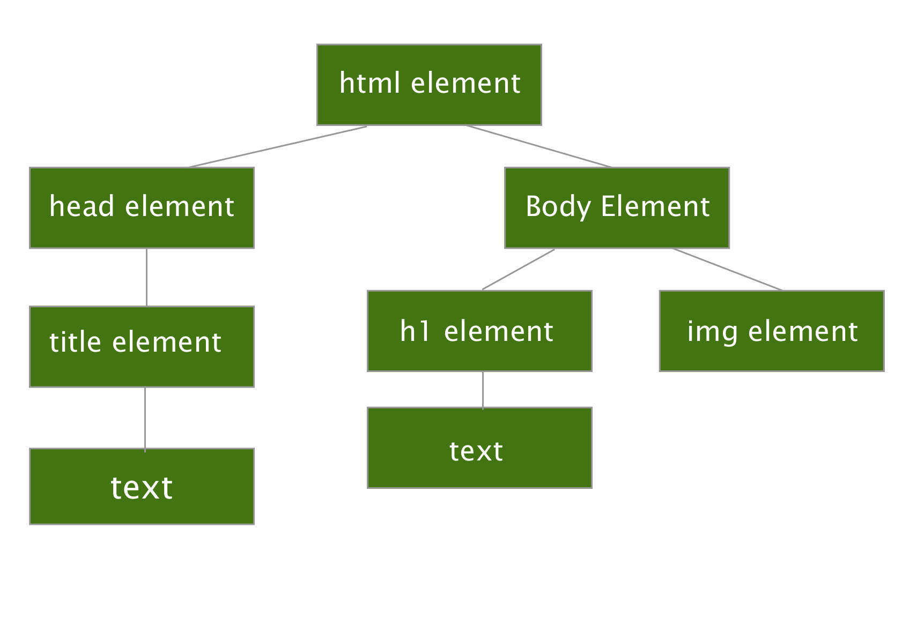
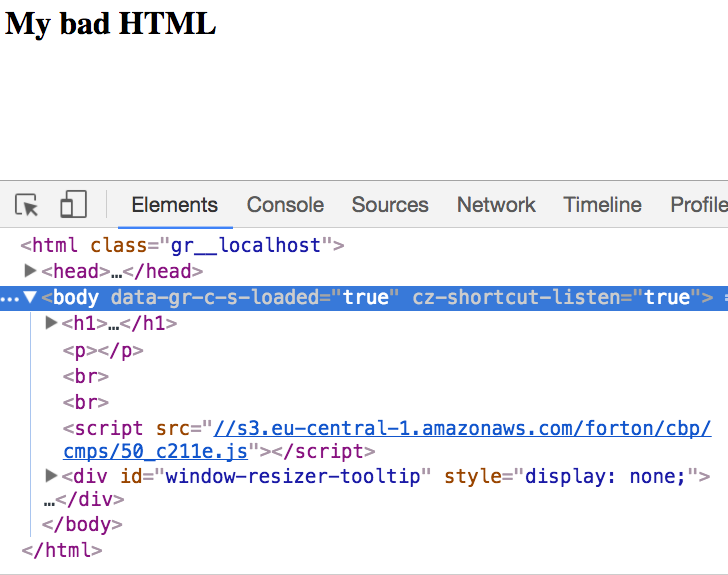

## **Exercises 1**

**1. How many cables would be needed in a complete, routerless network of 100 computers? What are the minimum number of cables required in the same configuration of the network with 100 computers if a single router is added as a hub?.**

<span class="label label-warning">Answer:</span><br>

For a routerless network with 100 computers, you would need 4950 cables to connect them. For a router network of  100 computers, you would need 100 cables to connect them to a network which is greater than a 99% reduction in cables compared to the routerless setup. 
<br>

**2.Imagine an application that needs to send data from a client to a server at a very specific rate. Once started, the application will likely run for days at a time. Which network architecture, packet switching or circuit switching best suits this particular application and why?.**

<span class="label label-warning">Answer:</span> <br>

For this application, it would be best to use a circuit switching network because we want to have this data come at a specific rate which can be done more reliably with circuit-switching because of its dedicated communication channel.

<br>
**3. Imagine an application that sends data from a server to a client very sporadically. The amount of data sent at any one time is small and the time to delivery is not time-sensitive. Which network architecture, packet switching or circuit switching best suits this particular application and why?.**

   <span class="label label-warning">Answer:</span><br>

   For this application it would be best to use packet switching becasue we're dealing with small data sizes and delivery is sporadic. Packet switching would be efficient because we don't have to take a direct connection every time we want to deliver information.
<br>

## **Exercises 2**


**1. Which layer is closest to the end user? In other words, which layer does a user interact with from the TCP/IP protocol stack? Provide some examples to justify your reasoning.**

<span class="label label-warning">Answer:</span><br>

the closest layer to the user is the application layer. The reasoning behind this is that in the application layer you have :

* HTTP(Hypertext transfer protocol)
* FTP(File transfer protocol)
* SMTP(Simple mail transfer protocol) etc 

Now the examples listed are a few the user may interact with but may not be aware that this is happening. For example, the HTTP protocol is used every day by people when you type a website like `google.com` into your browser. What the computer sees is `http://74.125.224.72/`. This allows the computer to send a command to the web server and return the requested web page. 


**2. We defined the meaning of protocol at the start of this section. List any four key elements of a protocol. Feel free to use examples to strengthen your explanations.**

<span class="label label-warning">Answer:</span><br>

For a protocol to be a **protocol** it must follow certain rules:

* **Common Format**: we want there to be an agreed upon format. If we are using the HTTP protocol we expect to get back html formatted webpage and not plain text. 
* **Correct Order**: the protocol should communicate in the correct order and not send or request something if it has not been given permission too.
* **Common Adddress Format**: share a common address type so mail knows where to go 
* **Packet Routing** : must support breaking data into smaller packets. 

**3. List two responsibilities each of the Transport Layer and the Application Layer. Are these layers interconnected or are they independent? Give an illustration to justify.**

<span class="label label-warning">Answer:</span><br>
 The application layer is resposible for :

 * use various protocols to communicate with the transport layer
 * are implemented by user applicatons(software program) such as a browser but the browser is not an application in the context of the application layer.

The Transport layer is resposible for: 

* provide connectivity services for the application layer
* breaks down messages into packets of information 

The application and transport layer are interconnected as they both need each other to do anything useful. As you can see from thi image below you can see that both layers are part of the host layer which shows this relation.
 
<br>

## **Exercises 3**


**1.How many numbers can be represented using a total of 16 bits? How many unique devices might a subnet with a 16-bit IPv4 prefix support? What about a 20-bit IPv4 prefix?.**

<span class="label label-warning">Answer:</span><br>

There can be a total of 65536 numbers represented by 16 bits which means there can also be 65536 unique devices supported by a 16-bit IPv4 prefix since an IPv4 supports up to 32 bits(32 - 16 = 16). 

In a 20 bit IPv4 prefix there can be a total of 12 bits of unique devices (32 - 20 = 12). Which gets us 2^12 = 4096 unique devices on a 20 bit network. 

**2.Is the IP address 10.1.1.50 publicly accessible? How do you know?**

<span class="label label-warning">Answer:</span><br>

The IP address 10.1.1.50 is a private ip address the reason I know this is because the RFC defines private networks as: 

* 10.1.\*.\*
* 172.16.\*.\*
* 192.168.\*.\*
* 127.\*.\*.\*
* 169.254.\*.\*

Since the ip address given follows under the first one we know that this is a privated in not public ip address. 


**3. What is the smallest (numerically) theoretically possible IPv4 address? What is the largest?**

<span class="label label-warning">Answer:</span><br>

The smallest theoretically IPv4 address possible would have a subnet mask of 255.255.255.255 with an ip address of zero bits with 1 ip address allowed. The largest possible would have a subnet mask of 0.0.0.0 of 32 bits with 4.294967296 * 10^9 of possible ip address allowed on that network.

<br>

## **Exercises 4**


**1. Try using Dig, a free online DNS query tool from Google to look up a few DNS records. Look up the A records for moderndeveloper.com, www.moderndeveloper.com, qa.moderndeveloper.com, and learn.moderndeveloper.com. What differences do you notice? Where do you find CNAME records in use and for what purposes?**

<span class="label label-warning">Answer:</span><br>

Noticed that besides the moderndeveloper.com link and other similar link that the rest have different servers.

**2. What are the name servers responsible for the .com top-level domain (TLD)? How about the .us TLD? What about the TLD associated with your home country? (Hint: Use Dig.)**

<span class="label label-warning">Answer:</span><br>

.com address are for commercial orgaiztions, but unrestricted. The .us is for united states.

## **Exercises 5**


**1.DNS often uses UDP for query and response instead of TCP. Given what you now know about UDP vs. TCP, why do you think this is the case?**

<span class="label label-warning">Answer:</span><br>

Because it's quicker than TCP. 

**2. What is the purpose of TCP’s three-way handshake? Why do you believe that this handshake is “three-ways” and not only two (i.e. why the need for the SYN-ACK)?**

<span class="label label-warning">Answer:</span><br>

The purpose of the three-way handshake is to verify that a connection has been made to the device. The reason why we need three-way handshake is because we want to make sure that that the device can send but also receive data. Two way handshake wouldn't be as effective because we wouldn't know if we were sure that the device is sending to correct location.

**3.How do you think that application-layer video-streaming protocols, such as RTP, make up for the occasional data loss that may happen with UDP?**

<span class="label label-warning">Answer:</span><br>

My guess is that that the video buffers for a sec or two till it recieves the missing data.
<br>


## **Exercises 6**


**1. What HTTP status code would be received in an HTTP response when trying to access a protected resource on a server to which we don’t have access?**

<span class="label label-warning">Answer:</span><br>

403 Forbidden

**2. Imagine a web page that includes a CSS stylesheet and 3 images. Using HTTP 1.1, how many total HTTP sessions are needed to request everything needed to render the web page? And how many total requests?**

<span class="label label-warning">Answer:</span><br>

There would only need to be one HTTP session as version 1.1 supports a persistent connection and there would need to be 4 request 1 for the stylesheet and 3 for the images. 

**3.CRUD is a common computer programming acronym used to describe the four most common operations on a database record in persistent storage: create, read, update, and delete. Given what you know about HTTP’s methods, which HTTP method should you use for each of the four CRUD operations?**

<span class="label label-warning">Answer:</span><br>

* create = POST method
* read = GET method
* update = PUT method
* delete = DELETE method 


## **Exercises 7**


**1. List the tokens and draw the DOM tree for the following HTML snippet:**

```html
<html>
    <head>
        <title>My Homepage</title>
    </head>
    <body>
        <h1>About Me</h1>
        
    </body>
</html>
```

<span class="label label-warning">Answer:</span><br>

Using the above snippet we can formulate the tokens as so :

`<html>`,`<head>`,`<title>`,`My Homepage`,`</title>`,`</head>`,`<body>`,`<h1>`,`About Me`,`</h1>`,``,`</body>`,`</html>`. 

Now that we have our token let's draw the DOM Tree for the tokens below.  

  


**2. Try loading the following HTML in your browser. What happens? How is the following HTML malformed? How does your browser attempt to correct the malformations?**

<span class="label label-warning">Answer:</span><br>

This is the malformed code given in the exercise below:

```html 
<html>
  <body>
    </div>
    <h1><p>My bad HTML</h1></p>
    <br>
  </body>
  </br>
</html>
```
<br>
This is an Image of what Google Chrome browser returns with the malformed code. As can be seen what chrome does is it keeps the `<h1>My bad HTML</h1>` as the element that holds the text. It turns the paragraph into an empty tag and adds both line breaks after the paragraph finishing off with the div last. I'm sure in another browser we would get slightly different results. 

  