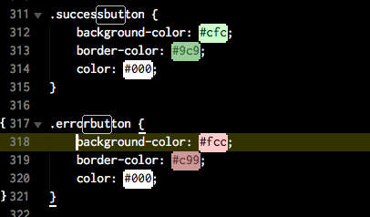

<style>

.button {
        color: #484848;
    background-color: #e0e0e0;
    -ms-transition: background-color 0.2s ease-in-out 0s, opacity 0.2s ease-in-out 0s;
    transition: background-color 0.2s ease-in-out 0s, opacity 0.2s ease-in-out 0s;
    font-weight: 600;
    font-family: "Open Sans","Helvetica Neue",Arial,Helvetica,Verdana,sans-serif;
    text-align: center;
    vertical-align: middle;
    text-transform: capitalize;
    -webkit-user-select: none;
    -ms-user-select: none;
    white-space: nowrap;
    overflow: hidden;
    padding: 0 18px;
    margin-right: 18px;
    border: 0 none;
    border-radius: 3px;
    display: inline-block;
    font-size: 15px;
    height: 35px;
    line-height: 35px;
    letter-spacing: 1px;
}

.p2 {
    color:#fff;
    background-color: red;
    transition: background-color: 0.2s ease-in-out 0s, opacity 0.2s ease-in-out 0s;
    outline: none;
    box-shadow: 1px 2px 2px #888888;
    transition: all 0.2s;
}

.p2:hover {
    background-color: #db4129;
}

input {
display: inline-block;
    padding: 0 .4em 0 .4em;
    margin-bottom: 2em;
    vertical-align: middle;
    border-radius: 3px;
    min-width: 50px;
    max-width: 635px;
    width: 100%;
    min-height: 29px;
    background-color: #ffffff;
    border: 2px solid #c9c9c9;
    margin: 0 0 24px 0;
}

.button-small {
    position: relative;
    right: 95px;
    top:2px;
    margin: 0 0 24px 0;
    padding: 3px;
    padding-left: 5px;
    margin: 0;
    height: 35px;
}

.p0 {
    color: #ffffff;
    background-color: #737373;
    -ms-transition: background-color 0.2s ease-in-out 0s, opacity 0.2s ease-in-out 0s;
    transition: background-color 0.2s ease-in-out 0s, opacity 0.2s ease-in-out 0s;
}

table {
    border-radius: 2px;
    margin: 20px 0px;
    width: 100%;
    border-collapse: collapse;
    border-spacing: 0;
}

</style>

<h2 style="color:#3CCAE6;">Exercises 1</h2>

**1.Mention three drawbacks of NOT using style guides in web development. Provide examples to justify your point. Also, list any possible drawbacks/side effects you can anticipate in using a Style Guide for a project.**

<span class="label label-warning">Answer:</span><br>

* Lack of Consistent Design 
 On a small site this might be easy to manage but on a large site it might be a big problem to keep the site looking like it represents the same brand. 

* Unstable Platform 
  Since all the code can look different then a person not familiar with the code won't know what does what. Or any new developer will have a harder time and possibly wasted time build similar style.

* Poor Communication 
 Because of the lack of a shared style, developers and designers will not be on the same page and you will end with a website that does not look like the one planned for. 

 A drawback to using a style guide is that it limits a developer from creating a unique style if its already been made. A style guide is like legos and even though you can build a lot of cool things with legos maybe you know that using clay would be better for what your trying to achieve. 
<br>

**2.Open the Mailchimp style guide located here and click the Form Elements tab on the left. These form elements are further categorized in individual components such as buttons, inputs, etc. Your task is to write HTML code to create a red colored button with the text Warning! contained within it.**

<span class="label label-warning">Answer:</span> <br>


<button class="button p2">Warning!</button>

<br>
**3. Referring to the same Form Elements tab of the Mailchimp style guide, write the HTML to create an input field with an attached button. The placeholder in the text field should contain the words Enter your password while the text on the button should state Submit. Leverage the code under the Inputs section of the Form Elements.**

   <span class="label label-warning">Answer:</span><br>


  <input type="text" name="inputandbutton" placeholder="Enter Your Password" class="av-text" id="inputandbutton"> 
  <a href="javascript:;" class="button-small p0">I'm a button</a> 


<br>

<h2 style="color:#3CCAE6">Exercises 2</h2>

**1.Creating Atoms <br>
Create the atoms listed in the table below. You can use the CSS classes used in the illustrations above to appropriately style these elements..**

<table class="table-example">
<thead>
<tr>
<th><strong>Atom Type</strong></th>
<th><strong>Value(s)</strong></th>
</tr>
</thead>
<tbody>
<tr>
<td>Container (use a div)</td>
<td>Empty</td>
</tr>
<tr>
<td>Label</td>
<td>Enter your feedback</td>
</tr>
<tr>
<td>Text field</td>
<td>Empty</td>
</tr>
<tr>
<td>Label</td>
<td>Are you a member?</td>
</tr>
<tr>
<td>Radio buttons</td>
<td>Yes, No</td>
</tr>
<tr>
<td>Submit Button</td>
<td>Submit feedback</td>
</tr>
</tbody>
</table>

<span class="label label-warning">Answer:</span><br>

<p data-height="265" data-theme-id="0" data-slug-hash="eBQaJM" data-default-tab="html,result" data-user="nopity" data-embed-version="2" data-pen-title="creating atoms" class="codepen">See the Pen <a href="http://codepen.io/nopity/pen/eBQaJM/">creating atoms</a> by oscar (<a href="http://codepen.io/nopity">@nopity</a>) on <a href="http://codepen.io">CodePen</a>.</p>
<script async src="https://production-assets.codepen.io/assets/embed/ei.js"></script>

<br>

**2.Creating Molecules <br>
Combine the atoms created in the previous step to create a molecule. It should contain all the atoms created in step 1 as follows:**

* Line 1 should have the label Enter your feedback followed by the text field.
* Line 2 should contain the label Are you a member? followed by the radio buttons.
* Line 3 should contain the Submit feedback button.
* All these elements should be arranged in the above-mentioned sequence inside the container..

<span class="label label-warning">Answer:</span> <br>


<p data-height="265" data-theme-id="0" data-slug-hash="jVQomG" data-default-tab="html,result" data-user="nopity" data-embed-version="2" data-pen-title="creating molecules" class="codepen">See the Pen <a href="http://codepen.io/nopity/pen/jVQomG/">creating molecules</a> by oscar (<a href="http://codepen.io/nopity">@nopity</a>) on <a href="http://codepen.io">CodePen</a>.</p>
<script async src="https://production-assets.codepen.io/assets/embed/ei.js"></script>


<br>
**3.Creating Organisms <br>
This task will involve combining molecules to create an organism. At this juncture, we have two molecules ready with us—first is the login form we created in the illustration and the second is the feedback form created in exercise task.**

**The objective of this task is to combine these two molecules into a single entity to form an organism. Use the required CSS to combine the two molecules by enclosing them into a larger container in order to distinguish between the inner and the outer containers. Each molecule is placed within its container.**

   <span class="label label-warning">Answer:</span><br>


<p data-height="388" data-theme-id="0" data-slug-hash="PbxrbE" data-default-tab="result" data-user="nopity" data-embed-version="2" data-pen-title="creating organisms" class="codepen">See the Pen <a href="http://codepen.io/nopity/pen/PbxrbE/">creating organisms</a> by oscar (<a href="http://codepen.io/nopity">@nopity</a>) on <a href="http://codepen.io">CodePen</a>.</p>
<script async src="https://production-assets.codepen.io/assets/embed/ei.js"></script>

<br>


<h2 style="color:#3CCAE6">Exercises 3</h2>

**1.Creating Text Boxes <br>In this first task, we will create two text boxes: one with soft rounded corners and the other with hard rounded corners. For the first box, create a box of type box-rounded-soft.**

Use the appropriate HTML element to create a text box and use the corresponding CSS from the boxes.css file located under the stylesheets folder.

Similarly, for the second task, create a box of type box-rounded-hard-right.3

Use the appropriate HTML element to create a text box and use the corresponding CSS from the boxes.css file located under the stylesheets folder.

<span class="label label-warning">Answer:</span> <br>


<p data-height="265" data-theme-id="0" data-slug-hash="bBOGKQ" data-default-tab="result" data-user="nopity" data-embed-version="2" data-pen-title="Text Boxes" class="codepen">See the Pen <a href="http://codepen.io/nopity/pen/bBOGKQ/">Text Boxes</a> by oscar (<a href="http://codepen.io/nopity">@nopity</a>) on <a href="http://codepen.io">CodePen</a>.</p>
<script async src="https://production-assets.codepen.io/assets/embed/ei.js"></script>
<br>

**2.Creating Buttons <br>In this first task, we will create two text boxes: one with soft rounded corners and the other with hard rounded corners. For the first box, create a box of type box-rounded-soft.**

Use the appropriate HTML element to create a text box and use the corresponding CSS from the boxes.css file located under the stylesheets folder.

Similarly, for the second task, create a box of type box-rounded-hard-right.3

Use the appropriate HTML element to create a text box and use the corresponding CSS from the boxes.css file located under the stylesheets folder.
<br>
<span class="label label-warning">Answer:</span> <br>
<p data-height="265" data-theme-id="0" data-slug-hash="dOwywV" data-default-tab="result" data-user="nopity" data-embed-version="2" data-pen-title="Creating Buttons" class="codepen">See the Pen <a href="http://codepen.io/nopity/pen/dOwywV/">Creating Buttons</a> by oscar (<a href="http://codepen.io/nopity">@nopity</a>) on <a href="http://codepen.io">CodePen</a>.</p>
<script async src="https://production-assets.codepen.io/assets/embed/ei.js"></script>

<br>

**3. Creating a Simple Form<br>
Let’s increase the level of complexity. This task involves creating a simple form that looks exactly like the one shown below:**


**Identify and list the atoms in the form along with the type of HTML element each represents. Use the appropriate HTML elements to create the form molecule as shown. The CSS classes that will be helpful for this task are: boxes.css (for text boxes), buttons.css (for Search button), forms.css (for the form), containers.css (for the form container), and any other as per requirements.**

<span class="label label-warning">Answer:</span> <br>

This was as close as I could get it. One thing that stumped me was how to get the blue "form elments" title to sit flush with with container and also how to get the second outer container. If you know how I would like to know this. 

<p data-height="265" data-theme-id="0" data-slug-hash="zoyxNw" data-default-tab="result" data-user="nopity" data-embed-version="2" data-pen-title="Simple Form" class="codepen">See the Pen <a href="http://codepen.io/nopity/pen/zoyxNw/">Simple Form</a> by oscar (<a href="http://codepen.io/nopity">@nopity</a>) on <a href="http://codepen.io">CodePen</a>.</p>
<script async src="https://production-assets.codepen.io/assets/embed/ei.js"></script>

<br>


<h2 style="color:#3CCAE6">Exercises 4</h2>

**1.Comparing Starbucks and Code for America**

**Both style guides are elaborate but unique in their own sense. Look at both style guides and come up with three points of similarity and three points of difference between the two resources. Justify your choices with suitable examples from the style guide.**

**This is a subjective question intended for looking at style guides more closely. There is no correct answer but make sure to come up with logical and relevant points for discussion.**


<span class="label label-warning">Answer:</span> <br>

      


**2.Other Style Guides**

**Search the world wide web and find five organizations (big or small, does not matter) who actively use the SGDD process. Share the link to their style guide and justify your choice of selecting a particular organization’s style guide with a short two-sentence description.**

**To get you started, Facebook and Google have style guides under active development, and they keep theirs constantly updated. Feel free to search for other organizations.**

<span class="label label-warning">Answer:</span> <br>

[Skype Style Guide](https://issuu.com/bondo/docs/skype_brand_book_-_look)

I picked this guide because it's well organized. 


**3.Additions to the Style Guide**

**If you look at the style guide for Starbucks, you will notice two options for buttons—Buttons and buttons 2015. We suspect this segregation was done to accommodate the new wave of design improvements and to keep up with current trends.**

**Can you locate some more areas where the Starbucks style guide needs to be upgraded? Since it was last updated two years ago, and many new UX features are now available at our disposal, there is much room for improvement. List the aspect that needs an upgrade along with an example and a relevant explanation for each. This task will help us to understand an already existing style guide and make improvements to it.**

<span class="label label-warning">Answer:</span> <br>

The list need to updated to a more animated functionality. Maybe a dropdown or pop out. 


<h2 style="color:#3CCAE6">Exercises 5</h2>

**1.Our initial style guide has just one type of button. The task here is to add two new styles of buttons: a success button and an error button. Locate the HTML pattern form-buttons.html and add the two more buttons. The first button should be created with a CSS class of successbutton with the text Success button between the button tags. Likewise, the second button should be created with a CSS class of errorbutton with the text Error button between its button tags.**


<span class="label label-warning">Answer:</span> <br>


**2.The next task is to create the CSS classes and add the CSS rules for them in the global CSS resource. Open the global.css file and locate the CSS rules for the button element. Add the following rules for the newly created CSS classes as shown:**
**For `successbutton` CSS class:**

```
   background-color: #cfc;
    border-color: #9c9;
    color: #000;
```

**For error button CSS class:**

```
    background-color: #fcc;
    border-color: #c99;
    color: #000;
```

<span class="label label-warning">Answer:</span> <br>



**3.The final task is to serve up the static website using Jekyll and view the new buttons in the statically generated webpage on the localhost. The two new buttons should be added with a green and red background color respectively. Take a screenshot of the style guide at this point of time and share it. You can use tools such as this in Google Chrome to perform a screen capture of the entire web page**

<span class="label label-warning">Answer:</span> <br>

       

<br>
<br>