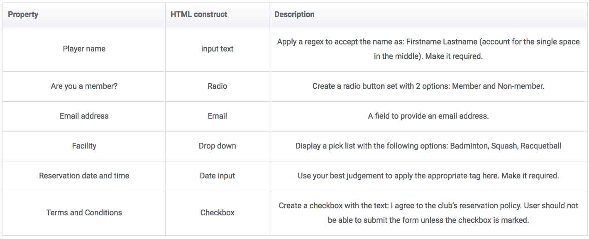

## **Exercises 1**


**1.Adding meta tags** <br>
Locate the main page `<header>`` tag and add meta tags to store the author name and a short description for the page.

<span class="label label-warning">Answer:</span><br>

```html
  <meta name="author" content="modern_developer" />
  <meta name="description" content="modern_developer_exercise" />
```

<br>

<br>
**2. Adding an article under a section** <br> 
The current code has a section with the header Modern Web Developer HTML Course (Section heading) that has three articles under it. Your task is to add a fourth article under this section with the following details: <br>

Article heading: Diving into HTML5<br>
Article description: Exploring the deep corners of HTML5! (This is the content inside the third <article> tag).

<span class="label label-warning">Answer:</span> <br>

```html 
    <article>
      <h3>Diving into HTML</h3>
      <p>
        Exploring the deep corners of HTML5! (This is the content inside the third <article> tag).
      </p>
    </article>
```

<br>
**3. Adding a new section with header and footer** <br>
<p>This task involves creating a new section after the “Modern Web Development CSS Course” section. It should contain an article inside it with the following details:</p>
Section Heading: Modern Web Developer JavaScript Course<br>
Article heading: Getting started with JavaScript <br> 
Article description: Combining the powers of HTML5 and awesome CSS styling to learn JavaScript constructs.<br>

Also, create a footer for this section with the following text contained in it:
Footer text: Footer for JavaScript course.

<span class="label label-warning">Answer:</span> <br>

```html 
   <section>
    <header>Modern Web Developer JavaScript Course</header>
     <article>
      <h3>Getting Started Javascript</h3>
      <p>
        Combining the powers of HTML5 and awesome CSS styling to learn JavaScript constructs.
      </p>
    </article>

  <footer>
   Footer text: Footer for JavaScript course.
  </footer>
  </section>
```


**4.Add a side note** <br>

Add a side note to the newly created section using the <aside> tag. Include the following side note text in it: JavaScript will make my web page interactive!

<span class="label label-warning">Answer:</span> 
<br>


```html
<aside class="sidenote">
    <p class="sideinfo">
      JavaScript will make my web page interactive!
    </p>
  </aside> 
</code>
```


<h3>Codepen of all additions:</h3>

<p data-height="265" data-theme-id="0" data-slug-hash="aBXPyB" data-default-tab="result" data-user="nopity" data-embed-version="2" data-pen-title="aBXPyB" class="codepen">See the Pen <a href="http://codepen.io/nopity/pen/aBXPyB/">aBXPyB</a> by oscar (<a href="http://codepen.io/nopity">@nopity</a>) on <a href="http://codepen.io">CodePen</a>.</p>
<script async src="https://production-assets.codepen.io/assets/embed/ei.js"></script>


## **Exercises 2**

**1.Exploring more tags**

We’ve already learned about the majority of HTML tags, the pre-existing ones as well as the ones new to HTML5. This first exercise involves the following tags/elements that we haven’t covered but that are very similar to the ones we discussed.<br>

`input type="file"`, `input type="color"`, `input type="url"`, `<progress>`` and `<time>`.
 
<br>

For each of these input elements, provide an example of its usage in a real-life scenario; for instance, its usage for a banking website or a pizza delivery website. Also, for each of these elements, give two advantages of using them in our forms.

<span class="label label-warning">Answer:</span> <br>

<p data-height="265" data-theme-id="0" data-slug-hash="NbomVK" data-default-tab="result" data-user="nopity" data-embed-version="2" data-pen-title="more tags" class="codepen">See the Pen <a href="http://codepen.io/nopity/pen/NbomVK/">more tags</a> by oscar (<a href="http://codepen.io/nopity">@nopity</a>) on <a href="http://codepen.io">CodePen</a>.</p>
<script async src="https://production-assets.codepen.io/assets/embed/ei.js"></script>

<br>


**2.Creating a form**

Create a simple form for a local fitness club to reserve courts. Use the template provided at the end of this block to get started. Ignore the CSS rules for now; adding HTML elements will automatically apply some styles but feel free to edit them. Add the following elements to the form:



Use fieldset to group the first three input elements together and give it a caption: Member demographics. Addlabels to describe the elements. Also, do not forget to add a submit button.

<span class="label label-warning">Answer:</span> <br>


<p data-height="265" data-theme-id="0" data-slug-hash="ZBPJWg" data-default-tab="result" data-user="nopity" data-embed-version="2" data-pen-title="form" class="codepen">See the Pen <a href="http://codepen.io/nopity/pen/ZBPJWg/">form</a> by oscar (<a href="http://codepen.io/nopity">@nopity</a>) on <a href="http://codepen.io">CodePen</a>.</p>
<script async src="https://production-assets.codepen.io/assets/embed/ei.js"></script>

## **Exercises 3**

**1.Creating a canvas image**

Create a canvas of width 300 and height 300. Add an appropriate border to mark the canvas boundary.
Create four squares that split the canvas into four equal parts, each having the dimensions of 150×150. Color fill the squares with blue, gray, maroon, and aqua in a clockwise manner starting from the top left square respectively.

<span class="label label-warning">Answer:</span> <br>

<p data-height="366" data-theme-id="0" data-slug-hash="oYVoVb" data-default-tab="result" data-user="nopity" data-embed-version="2" data-pen-title="4-square canvas" class="codepen">See the Pen <a href="http://codepen.io/nopity/pen/oYVoVb/">4-square canvas</a> by oscar (<a href="http://codepen.io/nopity">@nopity</a>) on <a href="http://codepen.io">CodePen</a>.</p>
<script async src="https://production-assets.codepen.io/assets/embed/ei.js"></script>


**2.Creating a SVG image**

Replicate the exact same steps but using SVG tags to render the image. Use alternate text to support older browsers.

<span class="label label-warning">Answer:</span> <br>

<p data-height="376" data-theme-id="0" data-slug-hash="QGoajZ" data-default-tab="result" data-user="nopity" data-embed-version="2" data-pen-title="4-square svg" class="codepen">See the Pen <a href="http://codepen.io/nopity/pen/QGoajZ/">4-square svg</a> by oscar (<a href="http://codepen.io/nopity">@nopity</a>) on <a href="http://codepen.io">CodePen</a>.</p>
<script async src="https://production-assets.codepen.io/assets/embed/ei.js"></script>